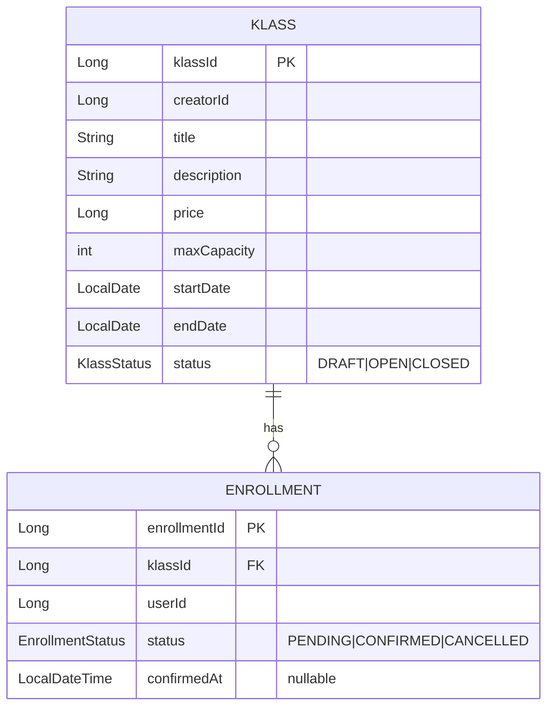

# Live Klass - 수강 신청 시스템

크리에이터(강사)가 강의를 개설하고, 클래스메이트(수강생)가 수강 신청·결제 확정·취소를 수행하는 수강 신청 시스템입니다.

## 기술 스택

| 항목 | 선택 |
|---|---|
| Language | Java 25 |
| Framework | Spring Boot 4.0.6 |
| ORM | Spring Data JPA (Hibernate 7.2) |
| DB | H2 (`MODE=MySQL`) |
| Validation | Spring Boot Validation (Jakarta Bean Validation) |
| Boilerplate | Lombok |
| Test | JUnit 5, Mockito, MockMvc, AssertJ |
| Build | Gradle |

## 실행 방법

### 빌드
```bash
./gradlew clean build
```

### 애플리케이션 기동
```bash
./gradlew bootRun
```

### API 호출

프로젝트 루트의 `http/test.http`에 모든 엔드포인트의 요청 예시를 정리해두었습니다.
**IntelliJ IDEA HTTP Client**에서 각 요청 좌측의 ▶ 아이콘 또는 `Ctrl/Cmd + Enter`로 실행할 수 있습니다.

> VS Code 사용자는 [REST Client](https://marketplace.visualstudio.com/items?itemName=humao.rest-client) 확장으로 동일하게 사용할 수 있습니다.

### H2 콘솔

`http://localhost:8080/h2-console`

```
JDBC URL : jdbc:h2:mem:live-klass
Username : heeeun
Password : (없음)
```

---

## API 목록 및 예시

모든 성공 응답은 아래 형식을 따릅니다.

```json
{
  "message": "요청이 성공적으로 처리되었습니다.",
  "data": { ... }
}
```

오류 응답은 다음 형식입니다.

```json
{
  "code": 400,
  "message": "오류 설명"
}
```

---

### 강의 등록

- 생성 시 `status`는 `DRAFT`로 고정됩니다.
- `price`는 0 이상 정수입니다 (무료 강의 허용).
- `maxCapacity`는 1 이상 정수입니다.

**요청**
```http
POST /api/v1/classes
X-User-Id: 1
Content-Type: application/json

{
  "title": "Java 입문",
  "description": "Java 기초부터 배우는 강의",
  "price": 50000,
  "maxCapacity": 30,
  "startDate": "2026-06-01",
  "endDate": "2026-06-30"
}
```

**성공 응답 (201)**
```json
{
  "message": "요청이 성공적으로 처리되었습니다.",
  "data": {
    "id": 1,
    "creatorId": 1,
    "title": "Java 입문",
    "description": "Java 기초부터 배우는 강의",
    "price": 50000,
    "maxCapacity": 30,
    "startDate": "2026-06-01",
    "endDate": "2026-06-30",
    "status": "DRAFT"
  }
}
```

**실패 응답 (400)** — 입력값 검증 실패
```json
{
  "code": 400,
  "message": "title: title must not be blank"
}
```

**실패 응답 (400)** — X-User-Id 누락
```json
{
  "code": 400,
  "message": "'X-User-Id' 헤더가 누락되었습니다."
}
```

**실패 응답 (400)** — X-User-Id 음수
```json
{
  "code": 400,
  "message": "X-User-Id는 양수여야 합니다."
}
```

---

### 강의 상태 변경

- 허용 전이: `DRAFT → OPEN`, `OPEN → CLOSED`
- 요청자(`X-User-Id`)가 강의 등록자(`creatorId`)와 다르면 403을 반환합니다.

**요청**
```http
PATCH /api/v1/classes/{classId}/status
X-User-Id: 1
Content-Type: application/json

{
  "status": "OPEN"
}
```

**성공 응답 (200)**
```json
{
  "message": "요청이 성공적으로 처리되었습니다.",
  "data": {
    "id": 1,
    "creatorId": 1,
    "title": "Java 입문",
    "description": "Java 기초부터 배우는 강의",
    "price": 50000,
    "maxCapacity": 30,
    "startDate": "2026-06-01",
    "endDate": "2026-06-30",
    "status": "OPEN"
  }
}
```

**실패 응답 (400)** — 입력값 검증 실패
```json
{
  "code": 400,
  "message": "status: status must not be null"
}
```

**실패 응답 (403)** — 강의 등록자가 아닌 사용자의 요청
```json
{
  "code": 403,
  "message": "접근 권한이 없습니다."
}
```

**실패 응답 (404)** — 강의 없음
```json
{
  "code": 404,
  "message": "강의를 찾을 수 없습니다."
}
```

**실패 응답 (422)** — 허용되지 않는 상태 전이
```json
{
  "code": 422,
  "message": "'DRAFT' → 'CLOSED' 상태 전이는 허용되지 않습니다."
}
```

---

### 강의 목록 조회

- `status` 쿼리 파라미터로 필터링할 수 있습니다 (`DRAFT`, `OPEN`, `CLOSED`).
- 파라미터를 생략하면 전체를 반환합니다.

**요청**
```http
GET /api/v1/classes?status=OPEN
```

**성공 응답 (200)**
```json
{
  "message": "요청이 성공적으로 처리되었습니다.",
  "data": [
    {
      "id": 1,
      "creatorId": 1,
      "title": "Java 입문",
      "description": "Java 기초부터 배우는 강의",
      "price": 50000,
      "maxCapacity": 30,
      "startDate": "2026-06-01",
      "endDate": "2026-06-30",
      "status": "OPEN"
    }
  ]
}
```

**실패 응답 (400)** — 유효하지 않은 status 값
```json
{
  "code": 400,
  "message": "'status'의 값이 올바르지 않습니다."
}
```

---

### 강의 상세 조회

- `currentEnrollmentCount`는 `CANCELLED`를 제외한 활성 신청 수(PENDING + CONFIRMED)입니다.

**요청**
```http
GET /api/v1/classes/{classId}
```

**성공 응답 (200)**
```json
{
  "message": "요청이 성공적으로 처리되었습니다.",
  "data": {
    "id": 1,
    "creatorId": 1,
    "title": "Java 입문",
    "description": "Java 기초부터 배우는 강의",
    "price": 50000,
    "maxCapacity": 30,
    "startDate": "2026-06-01",
    "endDate": "2026-06-30",
    "status": "OPEN",
    "currentEnrollmentCount": 12
  }
}
```

**실패 응답 (404)** — 강의 없음
```json
{
  "code": 404,
  "message": "강의를 찾을 수 없습니다."
}
```

---

### 수강 신청

- `OPEN` 상태인 강의에만 신청할 수 있습니다.
- 동일 강의에 `PENDING` 또는 `CONFIRMED` 상태의 신청이 이미 존재하면 중복 신청으로 거부됩니다.
- `CANCELLED` 처리된 신청이 있는 경우 재신청이 가능합니다.
- 정원 카운트는 `CANCELLED`를 제외한 모든 상태를 합산합니다.
- 생성 시 `status`는 `PENDING`으로 고정됩니다.

**요청**
```http
POST /api/v1/classes/{classId}/enrollments
X-User-Id: 200
```

**성공 응답 (201)**
```json
{
  "message": "요청이 성공적으로 처리되었습니다.",
  "data": {
    "id": 1,
    "klassId": 1,
    "userId": 200,
    "status": "PENDING",
    "confirmedAt": null
  }
}
```

**실패 응답 (400)** — X-User-Id 누락
```json
{
  "code": 400,
  "message": "'X-User-Id' 헤더가 누락되었습니다."
}
```

**실패 응답 (400)** — X-User-Id 음수
```json
{
  "code": 400,
  "message": "X-User-Id는 양수여야 합니다."
}
```

**실패 응답 (404)** — 강의 없음
```json
{
  "code": 404,
  "message": "강의를 찾을 수 없습니다."
}
```

**실패 응답 (409)** — 정원 초과
```json
{
  "code": 409,
  "message": "수강 정원이 초과되었습니다."
}
```

**실패 응답 (409)** — 중복 신청 (이미 PENDING 또는 CONFIRMED 신청 존재)
```json
{
  "code": 409,
  "message": "이미 수강 신청한 강의입니다."
}
```

**실패 응답 (409)** — CLOSED 강의 신청
```json
{
  "code": 409,
  "message": "이미 종료된 강의입니다."
}
```

**실패 응답 (422)** — DRAFT 강의 신청
```json
{
  "code": 422,
  "message": "OPEN 상태의 강의에만 신청할 수 있습니다."
}
```

---

### 결제 확정

- `PENDING → CONFIRMED` 전이 시 `confirmedAt`(서버 시각)이 기록됩니다.
- 신청 본인(`X-User-Id`)만 가능합니다.

**요청**
```http
PATCH /api/v1/enrollments/{enrollmentId}/confirm
X-User-Id: 200
```

**성공 응답 (200)**
```json
{
  "message": "요청이 성공적으로 처리되었습니다.",
  "data": {
    "id": 1,
    "klassId": 1,
    "userId": 200,
    "status": "CONFIRMED",
    "confirmedAt": "2026-06-01T10:00:00"
  }
}
```

**실패 응답 (400)** — X-User-Id 누락
```json
{
  "code": 400,
  "message": "'X-User-Id' 헤더가 누락되었습니다."
}
```

**실패 응답 (400)** — X-User-Id 음수
```json
{
  "code": 400,
  "message": "X-User-Id는 양수여야 합니다."
}
```

**실패 응답 (403)** — 신청 본인이 아닌 요청
```json
{
  "code": 403,
  "message": "접근 권한이 없습니다."
}
```

**실패 응답 (404)** — 수강 신청 없음
```json
{
  "code": 404,
  "message": "수강 신청을 찾을 수 없습니다."
}
```

**실패 응답 (422)** — 허용되지 않는 상태 전이 (예: 이미 취소된 신청)
```json
{
  "code": 422,
  "message": "'CANCELLED' → 'CONFIRMED' 상태 전이는 허용되지 않습니다."
}
```

---

### 수강 취소

- `PENDING → CANCELLED`: 즉시 취소 가능합니다.
- `CONFIRMED → CANCELLED`: `confirmedAt` 기준 **7일 이내**에만 가능합니다.
- 신청 본인(`X-User-Id`)만 가능합니다.

**요청**
```http
PATCH /api/v1/enrollments/{enrollmentId}/cancel
X-User-Id: 200
```

**성공 응답 (200)**
```json
{
  "message": "요청이 성공적으로 처리되었습니다.",
  "data": {
    "id": 1,
    "klassId": 1,
    "userId": 200,
    "status": "CANCELLED",
    "confirmedAt": "2026-06-01T10:00:00"
  }
}
```

**실패 응답 (400)** — X-User-Id 누락
```json
{
  "code": 400,
  "message": "'X-User-Id' 헤더가 누락되었습니다."
}
```

**실패 응답 (400)** — X-User-Id 음수
```json
{
  "code": 400,
  "message": "X-User-Id는 양수여야 합니다."
}
```

**실패 응답 (403)** — 신청 본인이 아닌 요청
```json
{
  "code": 403,
  "message": "접근 권한이 없습니다."
}
```

**실패 응답 (404)** — 수강 신청 없음
```json
{
  "code": 404,
  "message": "수강 신청을 찾을 수 없습니다."
}
```

**실패 응답 (422)** — 이미 취소된 신청
```json
{
  "code": 422,
  "message": "'CANCELLED' → 'CANCELLED' 상태 전이는 허용되지 않습니다."
}
```

**실패 응답 (422)** — 취소 기간 초과
```json
{
  "code": 422,
  "message": "결제 확정 후 7일이 지나 취소할 수 없습니다."
}
```

---

### 내 수강 목록 조회

- 페이지네이션을 지원합니다. 쿼리 파라미터: `page`(0-based, 기본값 0), `size`(기본값 20).

**요청**
```http
GET /api/v1/enrollments/me?page=0&size=5
X-User-Id: 200
```

**성공 응답 (200)**
```json
{
  "message": "요청이 성공적으로 처리되었습니다.",
  "data": {
    "content": [
      {
        "id": 1,
        "klassId": 1,
        "userId": 200,
        "status": "CONFIRMED",
        "confirmedAt": "2026-06-01T10:00:00"
      }
    ],
    "totalElements": 1,
    "totalPages": 1,
    "size": 5,
    "number": 0
  }
}
```

**실패 응답 (400)** — X-User-Id 누락
```json
{
  "code": 400,
  "message": "'X-User-Id' 헤더가 누락되었습니다."
}
```

**실패 응답 (400)** — X-User-Id 음수
```json
{
  "code": 400,
  "message": "X-User-Id는 양수여야 합니다."
}
```

---

## 데이터 모델

### ERD



### Klass 테이블

> **네이밍 노트**: 도메인 명을 `Class` 대신 `Klass`로 명명한 이유는 `java.lang.Class`와의 import 및 자동완성 충돌을 피하기 위함입니다.

| 필드 | 타입 | 설명 |
|---|---|---|
| klassId | Long | PK |
| creatorId | Long | 강의 등록자 userId |
| title | String | 강의 제목 (최대 255자) |
| description | String | 강의 설명 (최대 255자) |
| price | Long | 가격 (원 단위, 0 이상) |
| maxCapacity | int | 최대 수강 인원 (1 이상) |
| startDate | LocalDate | 수강 시작일 |
| endDate | LocalDate | 수강 종료일 (startDate 이후) |
| status | KlassStatus | DRAFT / OPEN / CLOSED |

### Enrollment 테이블

| 필드 | 타입 | 설명 |
|---|---|---|
| enrollmentId | Long | PK |
| klassId | Long | FK → klass |
| userId | Long | 수강생 userId |
| status | EnrollmentStatus | PENDING / CONFIRMED / CANCELLED |
| confirmedAt | LocalDateTime | 결제 확정 시각 (nullable) |

---

## 요구사항 해석 및 가정

### 요구사항 해석

- **강의 상태 전이는 단방향 순차 진행**으로 해석했습니다. `DRAFT → OPEN → CLOSED` 외의 전이(예: `OPEN → DRAFT`, `CLOSED → OPEN`)는 허용하지 않습니다.
- **수강 신청 가능 상태는 `OPEN`만**으로 해석했습니다. `DRAFT` 상태의 강의는 아직 공개 전이므로 신청을 받지 않으며, `CLOSED`는 모집이 종료된 상태입니다.
- **정원 카운트는 취소를 제외**합니다. 취소된 신청은 자리를 차지하지 않으므로, 정원 여유 계산 시 `CANCELLED` 상태를 제외합니다.
- **강의 조회(목록/상세)는 공개 API**로 해석했습니다. 강의를 둘러보는 행위는 로그인 없이도 가능해야 한다고 판단하여 `X-User-Id` 헤더를 요구하지 않습니다.

### 가정

- **인증 없이 `X-User-Id` 헤더를 신뢰합니다.** 실제 인증 시스템이 없으므로 헤더에 담긴 값을 요청자 식별자로 사용합니다. 단, 음수·0 값은 유효하지 않은 식별자로 보고 400을 반환합니다.
- **취소 후 재신청이 가능합니다.** 요구사항에 명시적인 금지 조항이 없으므로, `CANCELLED` 상태 신청이 있어도 신규 신청을 허용합니다.
- **`confirmedAt`은 서버 시각 기준**으로 기록합니다. 클라이언트 시각을 신뢰하지 않으며, 취소 기간(7일) 계산도 서버 시각을 기준으로 합니다.
- **`confirmedAt`은 취소 후에도 유지됩니다.** 결제 확정 이력은 취소 이후에도 보존해야 한다고 판단했습니다. 취소 시 `confirmedAt`을 null로 덮어쓰지 않으며, 응답에도 원래 값을 그대로 반환합니다.

---

## 설계 결정과 이유

### Clean Architecture

`interfaces → application → domain ← infrastructure` 방향으로 의존성을 제어했습니다.

**도메인의 순수성**: `Klass`와 `Enrollment`는 JPA, Spring, Jakarta EE 어노테이션 없이 순수 Java Record로 작성했습니다. 이 덕분에 도메인 객체를 `new Klass(...)`, `new Enrollment(...)`처럼 평범한 생성자 호출로 직접 만들 수 있어, Spring 컨텍스트나 DB 연결 없이 도메인 불변 조건을 단위 테스트로 검증할 수 있습니다. 또한 코드를 읽을 때 `@Entity`, `@Column` 같은 기술 어노테이션이 비즈니스 규칙을 가리지 않아 도메인 로직이 그대로 드러납니다.

**의존성 역전**: `application` 계층이 `KlassRepository`, `EnrollmentRepository` 인터페이스를 직접 정의하고 `infrastructure` 계층이 이를 구현합니다. 서비스 코드는 JPA의 존재를 알지 못하며, JPA가 서비스에 의존하는 방향입니다. 인프라 구현체를 교체해도 비즈니스 로직은 수정이 불필요합니다.

**계층별 테스트 전략 분리**: 각 계층을 독립적으로 검증할 수 있습니다. 컨트롤러는 `@WebMvcTest`로 HTTP 매핑과 입력 검증만 빠르게 테스트하고, 서비스는 Mock Repository로 비즈니스 로직을 DB 없이 검증하며, 동시성은 `@SpringBootTest`로 실제 H2에서 검증합니다. 계층 간 관심사가 분리되어 있으므로 각 테스트가 자신의 책임 범위만 다룹니다.

### Java Record 도메인 모델

`Klass`와 `Enrollment`를 Java Record로 구현했습니다.

Record의 모든 필드는 `final`로 선언되어 생성 이후 외부에서 값을 바꿀 수 없는 **불변(Immutable) 객체**입니다. 상태 전환이 필요할 때는 `withStatus()`, `confirm()`, `cancel()`처럼 변경된 값을 담은 **새 객체를 반환**하는 메서드를 명시적으로 호출해야 합니다. 도메인 객체의 상태가 어디서 어떻게 바뀌는지 코드상에서 추적이 용이하고, 의도치 않은 상태 변이로 인한 버그를 원천적으로 차단합니다.

또한 팩토리 메서드(`Klass.createDraft()`, `Enrollment.pending()`)를 통해 초기 상태(`DRAFT`, `PENDING`)와 초기값(`confirmedAt = null`)을 도메인 내부에 캡슐화했습니다. 서비스 계층이 도메인의 초기 상태나 내부 규칙을 직접 알 필요가 없어, 도메인 정보가 서비스로 누출되는 것을 방지합니다.

### 비관적 락(Pessimistic Lock)

수강 신청은 **"정원 확인 → 신청 생성"** 두 단계로 이루어집니다. 동시 요청 시 두 스레드가 모두 여석이 있다고 판단하고 초과 신청을 생성하는 TOCTOU(Time-Of-Check-Time-Of-Use) 문제가 발생할 수 있습니다.

**낙관적 락을 선택하지 않은 이유:** 낙관적 락(버전 필드)을 `Klass`에 적용하면, 수강 신청이 발생할 때마다 강의 버전이 충돌합니다. 신청자가 많을수록 재시도 횟수가 폭발적으로 증가해 처리량이 저하됩니다.

**비관적 락을 선택한 이유:** `SELECT ... FOR UPDATE`로 강의 레코드를 잠그면 정원 확인부터 신청 생성까지가 직렬화됩니다. 동시 요청이 들어와도 순차 처리되어 정원 초과가 발생하지 않습니다. 락 범위는 특정 강의 1개 row로 한정되고, 락 유지 시간은 단일 INSERT 트랜잭션에 국한됩니다. 따라서 락 경합은 동일 강의에 동시 신청하는 사용자 사이에서만 발생하며, 서로 다른 강의의 신청은 서로 블로킹하지 않습니다.

H2 `MODE=MySQL`에서 `PESSIMISTIC_WRITE`가 실제로 블로킹되는지는, maxCapacity=1인 강의에 5개 스레드가 동시 신청하는 통합 테스트(`EnrollmentConcurrencyTest`)로 검증했습니다.

---

## 테스트 실행

### 전체 테스트
```bash
./gradlew test
```

### 개별 테스트
```bash
# 동시성 통합 테스트
./gradlew test --tests "*.EnrollmentConcurrencyTest"

# 서비스 단위 테스트
./gradlew test --tests "*.EnrollmentServiceTest"
./gradlew test --tests "*.KlassServiceTest"

# 컨트롤러 테스트
./gradlew test --tests "*.EnrollmentControllerTest"
./gradlew test --tests "*.KlassControllerTest"
```

### 테스트 구성

| 테스트 | 구성 | 목적 |
|---|---|---|
| `KlassControllerTest` | `@WebMvcTest` + Mock Usecase | HTTP 입력 검증, 응답 코드 |
| `EnrollmentControllerTest` | `@WebMvcTest` + Mock Usecase | HTTP 입력 검증, 응답 코드 |
| `KlassServiceTest` | Mockito (Mock Repository) | 강의 상태 전이 비즈니스 로직 |
| `EnrollmentServiceTest` | Mockito (Mock Repository) | 수강 신청 비즈니스 로직 |
| `EnrollmentConcurrencyTest` | `@SpringBootTest` + 실제 H2 | 비관적 락 동시성 검증 |

---

## 미구현 / 제약사항

### 미구현 기능

#### 대기열(Waitlist)

구현 시 `WaitlistEntry` 도메인을 추가하고, 강의가 `CLOSED`로 전환되거나 수강 취소가 발생할 때 대기자에게 신청 기회를 부여하는 이벤트 처리가 필요합니다.

#### 강의별 수강생 목록 조회 (크리에이터 전용)

`EnrollmentRepository`에 `findByKlassId(klassId, pageable)`를 추가하고, 요청자가 해당 강의의 `creatorId`와 일치하는지 검증하는 서비스 로직이 필요합니다.

### 제약사항

- **인증/인가 없음:** `X-User-Id` 헤더 값을 그대로 신뢰합니다. 실제 서비스라면 JWT 등 인증 레이어가 필요합니다.
- **인메모리 DB:** H2를 사용하므로 애플리케이션 재시작 시 데이터가 초기화됩니다. 영속성이 필요한 경우 MySQL 등으로 교체가 필요합니다.
- **트랜잭션 격리 수준:** H2 기본값은 `READ_COMMITTED`입니다. 운영 환경 MySQL의 기본값(`REPEATABLE_READ`)과 차이가 있을 수 있습니다.

---

## AI 활용 범위

**사용 도구:** Claude.ai

### 코드 스펙 검사 및 예외 발생 가능 구간 분석

컨트롤러, 서비스, 도메인 전 계층을 대상으로 입력 경계에서 예외가 발생할 수 있는 구간을 파일별로 점검했습니다. `X-User-Id` 헤더에 음수·0이 입력되는 경우, JSON 바디에 타입 불일치 값이 포함되는 경우, 문자열 필드가 DB 컬럼 길이(255자)를 초과하는 경우 등을 식별하고, 각각에 대한 수정 방향을 도출했습니다. 

### 엣지 케이스 분석

Spring Data의 `PageableHandlerMethodArgumentResolver`가 `page=-1` 등의 음수 값을 0으로 자동 클램핑하여 예외가 발생하지 않는다는 점, 동시성 테스트에서 `CountDownLatch`로 스레드 동시 진입을 보장하는 구조 설계, H2 `MODE=MySQL`에서 `PESSIMISTIC_WRITE`가 실제로 블로킹되는지 검증하는 방법을 논의했습니다.
